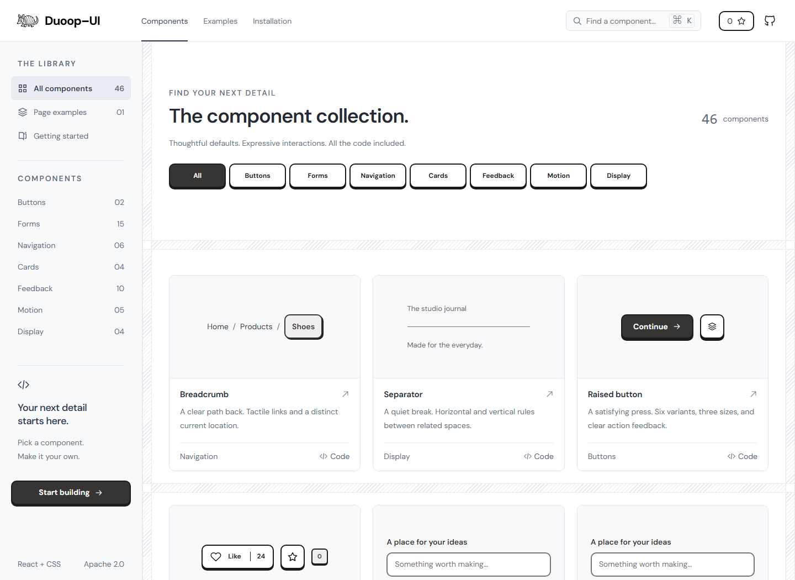

<div align="center">


# Duoop UI

### Interfaces you can feel. Source code you can own.

Tactile React components with crisp outlines, playful motion, and satisfying feedback.

**46 components across 7 categories — interactive previews, source code, and downloadable examples.**

[**Explore the live catalog →**](https://duoop-ui.com/) · [Components](https://duoop-ui.com/?page=components) · [Installation](https://duoop-ui.com/?page=installation) · [Page examples](https://duoop-ui.com/?page=examples)

[](https://github.com/gus-rlin/Duoop-UI/actions/workflows/ci.yml)
[](LICENSE)
[](https://react.dev/)

</div>

[](https://duoop-ui.com/)

## Why Duoop?

- **A distinctive feel.** Raised surfaces, short shadows, expressive SVGs, and motion that responds to your actions.
- **Source included.** Preview, inspect, and copy complete JSX and CSS files, including local helpers.
- **Runnable downloads.** Download a Vite project with the displayed example, styles, and dependencies.
- **Plain React and CSS.** No Tailwind setup, custom CLI, or global provider required for a basic button.
- **Interaction matters.** Keyboard behavior, visible focus, reduced motion, and clear action feedback are part of the design.

**Duoop UI is published on npm as `duoop-ui`.** Install the library with npm to use its components in your React application. This repository contains the library source and documentation site, under Apache 2.0.

## Install the library

Install the published [duoop-ui package](https://www.npmjs.com/package/duoop-ui) in your React 19 application:

```sh
npm i duoop-ui
```

The package installs its runtime dependencies automatically. React and React DOM are peer dependencies supplied by your React 19 application.

Import the stylesheet once in your application entry, then import components by name:

```jsx
import { Button, Card } from 'duoop-ui';
import 'duoop-ui/styles.css';

export default function App() {
  return <Card><Button onClick={() => alert('Hello!')}>Press me</Button></Card>;
}
```

The ESM package contains all public components, their compound components and helpers, including `IconButton`. It excludes the catalogue, demos and development tools. Your bundler can remove unused JavaScript exports; the single stylesheet includes the full collection, the shared foundation and Leaflet styles. The foundation sets page defaults such as body margin and font, so import your application overrides afterwards. DM Sans remains an optional font installation.

Use a React bundler such as Vite. For Next.js, import the stylesheet in the root layout and use interactive components from a client component; the library entry preserves its `"use client"` boundary. Next.js and server rendering have not been separately validated. Dedicated TypeScript declarations are not supplied.

## Explore the collection

**46 components · 7 categories**, each with downloadable examples. The collection includes Breadcrumb and Separator, plus Tooltip, Popover, Slider, Calendar, Date Picker, Table, Pagination, Sheet, File Upload, Skeleton and Alert. See [integration notes and verification](docs/essential-components.md).

| Collection | Explore |
| --- | --- |
| Buttons | [Raised buttons and reactions](https://duoop-ui.com/?category=Buttons) |
| Forms | [Inputs, selection, and validation](https://duoop-ui.com/?category=Forms) |
| Navigation | [Menus and tabs](https://duoop-ui.com/?category=Navigation) |
| Cards | [Cards and composed layouts](https://duoop-ui.com/?category=Cards) |
| Feedback | [Toasts and progress](https://duoop-ui.com/?category=Feedback) |
| Motion | [Animated text and expressive interactions](https://duoop-ui.com/?category=Motion) |
| Display | [Avatars, maps, and more](https://duoop-ui.com/?category=Display) |

Explore the [outdoor adventure landing page](https://duoop-ui.com/?page=examples&example=landing), the current public page example, with [source](src/examples/LandingPage.jsx), styles and a runnable download. [SettingsPage.jsx](src/examples/SettingsPage.jsx) remains a source-only example in the repository; it is not listed in the public catalog. Example brands, pricing, forms, and persistence are demonstrations; connect your own services when adapting them.

## Optional: own the source files

For direct edits to a component implementation, follow the [source-copy guide](docs/source-installation.md), or choose **Download project** in the catalog for a complete Vite example. These are optional ways to use the same components. The npm installation above is complete on its own.

## Develop and test

Catalog tooling requires **Node.js 22.18+ in the 22.x line, or 24.11+**, and npm.

```sh
git clone https://github.com/gus-rlin/Duoop-UI.git
cd Duoop-UI
npm ci
npm run dev
```

| Command | Purpose |
| --- | --- |
| `npm run build` | Build the static site into `dist/`. |
| `npm run build:lib` | Build the npm library into `lib/`. |
| `npm pack` | Build and create the installable `duoop-ui-1.0.0.tgz` archive. |
| `npm run test:package` | Install the archive in an isolated app; verify exports, build, styling and interaction. |
| `npm run preview` | Preview the production build. |
| `npm run test:docs` | Check documentation counts, public URLs, local links and documented npm scripts against the project. |
| `npm test` | Run documentation checks, build, check imports, run essentials and public browser/SEO tests, then build downloaded projects. See current limitations in VALIDATION.md. |
| `npm run test:essentials` | Start its own server and check the eleven essential component families. |
| `npm run test:essential-downloads` | Start its own server, download and build essential starters and gallery variants. |
| `npm run test:navigation` | Start its own server and check Breadcrumb and Separator. |
| `npm run test:primitives` | Run detailed primitive suites against a dev server on port 5176. |
| `npm run test:a11y` | Audit galleries against a dev server on port 5176. |
| `npm run test:pages` | Legacy two-page regression script; requires old downloads and selectors. See VALIDATION.md before using. |
| `npm run test:integration` | Verify the optional source-copy guide in a fresh Vite app; requires npm access. |

Install Chromium with `npx playwright install chromium`. For a fixed dev port, run `npm run dev -- --port 5176 --strictPort`. Most primitive suites accept `TEST_URL`, but some diagnostic scripts use fixed addresses; keep port 5176 for the combined run. Reports and screenshots go to the ignored `artifacts/` directory.

GitHub CI runs documentation checks, the production build, import checks, package installation tests, essential-component browser checks, and SEO browser tests. See [VALIDATION.md](VALIDATION.md) for verification scope and known limitations. Automated accessibility checks are not a comprehensive certification.

## Deployment

Maintainer instructions for [packing and publishing a new npm release](CONTRIBUTING.md#publish-a-new-npm-release-maintainers) are in the contribution guide.

### Documentation site

The live site is on [Cloudflare Pages](https://duoop-ui.com/). Deploy `dist/` over HTTPS for clipboard access. Query-based deep links do not need route rewrites. Preserve public TXT/XML files and allow required remote demo assets in any CSP. See [SEO.md](SEO.md).

Legacy personal entries in `duoop-ui.components.v1` are no longer displayed; their stored data is not deleted or rewritten.

## Contribute

Start with [CONTRIBUTING.md](CONTRIBUTING.md), follow the [design guidelines](design.md), and use the [issue templates](https://github.com/gus-rlin/Duoop-UI/issues/new/choose) for bugs and ideas.

Useful entry points: [catalog metadata](src/catalog/catalog.js), [integration recipes](src/catalog/recipes.js), [source bundling](src/catalog/source-bundle.js), and [code documentation](src/components/Button/Documentation.jsx).

Documentation ownership and the update checklist are in [CONTRIBUTING.md](CONTRIBUTING.md#keep-documentation-consistent). Catalog counts come from `entries` and `categories` in `src/catalog/catalog.js`; package requirements come from `package.json`; canonical URLs come from `src/catalog/seo.js`. Counts refer to catalog entries, not the larger set of exported compound components and helpers.

If Duoop helps you build something, a GitHub star helps others discover it.

## License

[Apache License 2.0](LICENSE). Preserve required license and attribution notices. Third-party dependencies and demo assets retain their own terms.
